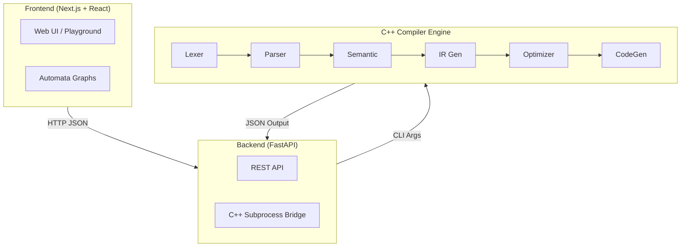

# CompilerEdu: Full-Stack Educational Compiler & Automata Visualizer

**Built by:** Yousef Amr Abdelazeem Elbish  
**ID:** 2301295  
**Group:** S1  
**Subject:** Compiler  
**Project:** Faculty of Computers & Artificial Intelligence, Al Ryada University for Science and Technology (RST)  
**Date:** May 2026  

[](https://github.com/elbish1)
[](https://www.linkedin.com/in/elbish1)
[](https://yousef-elbish.vercel.app)
[](mailto:yousefelbish@gmail.com)

Welcome to **CompilerEdu**, a premium, interactive full-stack web application designed to teach the inner workings of compilers and automata theory. 

This project takes a core C++ compiler engine and exposes it through a modern, beautiful web interface. You can type code into an in-browser code editor, hit run, and watch step-by-step as the code is transformed from raw text into pseudo-assembly language.

---

## 📖 What is a Compiler? (A Beginner's Guide)

Imagine you only speak English, but your friend only speaks Japanese. To communicate, you need a translator. A **compiler** is a specialized software program that acts as a translator between humans and computers. 

You write code in a "High-Level Language" (like C++, Java, or Python) which is easy for humans to read. The computer's brain (the CPU), however, only understands "Machine Code"—a series of 1s and 0s. The compiler translates your human-readable code into this machine code *before* the program is ever run.

Because translating an entire program at once is incredibly complex, the compiler breaks the job down into an organized "pipeline" of distinct phases:

### 1. Lexical Analysis (Scanning)
The compiler reads the raw characters (like `i`, `n`, `t`, ` `, `x`) and groups them into meaningful "words" called **Tokens** (like `Keyword(int)`, `Identifier(x)`). It throws away spaces and comments.

### 2. Syntax Analysis (Parsing)
The compiler checks the grammar. Just like English has rules (Noun + Verb), programming languages have strict syntax rules. It takes the tokens and builds a **Parse Tree** or **Abstract Syntax Tree (AST)** that represents the hierarchical structure of the code.

### 3. Semantic Analysis
The compiler checks if the grammatically correct code actually makes logical sense. For example, you can't add a word to a number. It performs **Type Checking** and ensures variables are declared before they are used.

### 4. Intermediate Representation (IR)
Translating directly from C++ to Windows machine code is hard. Instead, the compiler translates the AST into a "middle-ground" language. A common format is **Three-Address Code (TAC)**, which breaks complex math into simple, bite-sized instructions.

### 5. Optimization
The magic phase. The compiler rewrites the IR to make it faster and use less memory, without changing what the program actually does. It pre-calculates constants and deletes code that will never run.

### 6. Code Generation
The final step. The compiler translates the optimized IR into the target machine code or assembly language specifically designed for your computer's CPU.

---

## 🕸️ Automata Theory (Regex, NFA, DFA)

Underneath the hood, the **Lexical Analyzer** relies on Automata Theory to recognize patterns (like identifying what an email address or a number looks like).

- **Regular Expressions (Regex):** A text pattern, e.g., `(a|b)*abb`.
- **NFA (Nondeterministic Finite Automaton):** A flexible state-machine graph generated from the Regex. It can "guess" paths using Epsilon (ε) transitions.
- **DFA (Deterministic Finite Automaton):** A strict, optimized version of the NFA. It has exactly one path for every character, making it incredibly fast for computers to execute.

---

## ✨ Web Platform Features

1. **Interactive Compiler Playground:** 
   - A VS Code-like Monaco editor with syntax highlighting.
   - Interactive tabs to view **Tokens**, **Parse Tree**, **Semantic Errors**, **IR Code**, and **Optimized Target Code**.
2. **Automata Visualizer:**
   - Type any Regular Expression to instantly generate its NFA and DFA graphs.
   - Beautiful, interactive graph visualization using React Flow.
   - View the generated Regular Grammar and step-by-step String Derivations.
3. **Theory Hub:**
   - A dedicated educational hub with beautifully formatted, beginner-friendly articles explaining every phase of the compiler pipeline in depth.

---

## 🏗️ Architecture & Workflow

The platform bridges a blazingly fast C++ compiler engine with a modern web stack.



**Workflow:**
1. You type code in the React Frontend and click "Run".
2. Next.js sends the source code via HTTP POST to the FastAPI backend.
3. FastAPI writes the code to a temporary file and executes the compiled `compiler_api.exe` C++ binary.
4. The C++ engine processes the code through all phases and prints structured JSON to standard output.
5. FastAPI reads the JSON, handles any potential errors or timeouts, and sends it back to the Frontend.
6. The Frontend parses the JSON and beautifully renders the trees, tables, and graphs.

---

## 🚀 How to Run Locally

### Option 1: Docker (Recommended)
You can run the entire full-stack application using Docker Compose.

1. Make sure [Docker](https://www.docker.com/) is installed.
2. Open a terminal in the project root and run:
   ```bash
   docker compose up -d --build
   ```
3. Open your browser to `http://localhost:3000`.

### Option 2: Manual Setup (Local Development)

**Prerequisites:**
- Node.js (v18+)
- Python (3.10+)
- A C++ Compiler (`g++`)

**Step 1: Build the C++ Engine**
```cmd
build.bat
```

**Step 2: Start the FastAPI Backend**
```cmd
pip install -r backend/requirements.txt
python -m uvicorn backend.main:app --host 0.0.0.0 --port 8000
```

**Step 3: Start the Next.js Frontend**
Open a new terminal:
```cmd
cd frontend
npm install
npm run dev
```
Open your browser to `http://localhost:3000`.

---

## 🛠️ Tech Stack

- **Engine:** Modern C++ (Standard Library only)
- **Backend:** Python, FastAPI, Uvicorn, Pydantic
- **Frontend:** Next.js (App Router), React, TypeScript, Tailwind CSS v4, ShadCN UI
- **Visualization:** React Flow, Dagre, Monaco Editor, Framer Motion
- **Deployment:** Docker, Docker Compose
